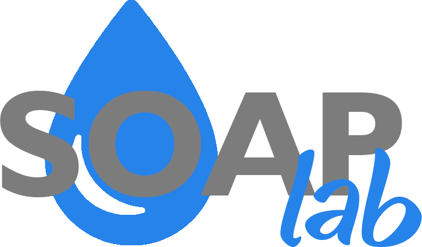
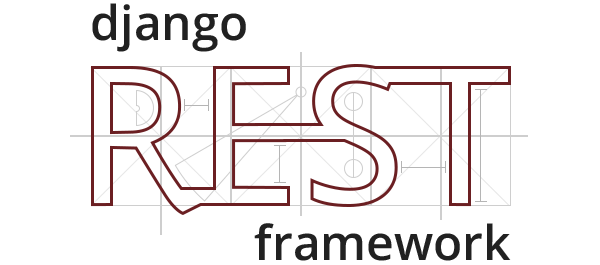

# Soap Lab - Backend


## O repositório "Máquina de Sabão - Backend" contém o backend para o aplicativo da máquina de sabão desenvolvido na disciplina de Projeto Integrador 2, no 1º semestre de 2019.

### 1. Descrição do projeto

O projeto "Soap lab" tem como intuito oferecer uma alternativa sustentável ao descarte indevido de óleo vegetal caseiro. A máquina recebe como insumo óleo vegetal que seria descartado, e juntamente com alguns outros ingredientes, produz uma quantidade de sabonete líquido que pode ser utilizado posteriormente. O aplicativo frontend atua como interface de usuário para controle da máquina, além de oferecer funcionalidades úteis como histórico de fabricações anteriores, e gráficos comparativos da economia provida por utilizar o sabão produzido pela máquina.

### 2. Tecnologias

#### 2.1 Python

Python é uma linguagem de programação que te permite trabalhar rapidamente e integrar sistemas de maneira mais eficaz.(https://www.python.org/).


#### 2.1 Django Rest Framework

Django REST Framework é um poderoso e flexível kit de ferramentas para construir Web APIs.(https://www.django-rest-framework.org/).



#### 2.1 Keras

Keras é uma API de redes neurais de alto nível, escrita em Python e capaz de rodar em cima do TensorFlow, CNTK ou Theano.(https://keras.io/).


#### 2.2. Frontend

O repositório do frontend da aplicação pode ser encontrado aqui: https://github.com/pi2-fga/201901-MaquinaSabao-Frontend.

## Execução Ambiente - API Máquina de Sabão

#### Pré-requisitos:
- docker e docker-compose
- Acesse o arquivo /api/settings.py
- Descomente o database referente ao sqlite (linha 96 à linha 101) e comente o database referente ao postgresql (linha 85 à linha 94)

### Para construir a imagem e executar o container:
```
$ docker-compose up --build
```

### Para executar o comando (sem construir a imagem):
```
$ docker-compose up
```

### Para executar o docker bash (com container up):
```
$ docker-compose exec web bash
```

### Para criar e executar as migrations (via web bash):
```
$ python manage.py makemigrations
```

```
$ python manage.py migrate
```


